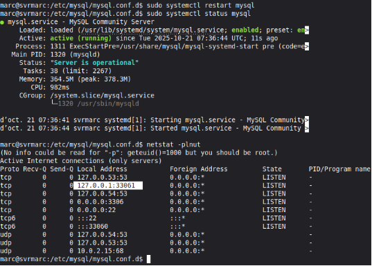
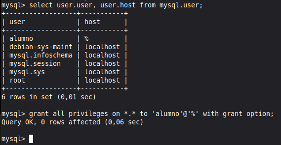

CONEXIÓN ADMINISTRATIVA

Marc Brines Bañuls 2 ASIX GBD

Comencem editant el fitxer de configuració on li establirem un port a la ip global de tots els equips.

*Fig 1: Fitxer de configuració editat.*

*Fig 2: Reinici del servei, estat del servei i comprovació.*

Marc Brines Bañuls 2 ASIX GBD

2

*Fig 3: Donem els privilegis corresponents.*

*Fig 4: Comprovem l’accés desde l’usuari alumno.*
Marc Brines Bañuls 2 ASIX GBD

3
