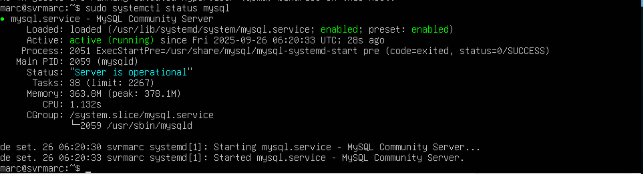

INSTALACIÓ DE MYSQL EN BINARIS

Primer que res actualitzem per a baixar paquets, i després començarem amb la instalació.

*Fig 1:Actualització.*

*Fig 2: Instalació de libaio.*

*Fig 3: Descarreguem des del enllaç.*

*Fig 4: Desempaquetem.*

*Fig 5: creem enllaç simbòlic i donem permisos.*

Com després de fer proves, no ens ha funcionat per la llibreria “libaio” anem a fer l’instal·lació i configuració a través de “apt-get”.

Abans de començar, fiquem dues targetes de red a cada màquina, on es troben en la mateixa red, en la red interna, i altra NAT per a tindre ixida sense complicacions a internet.

*Fig 6: IP server*

*Fig 7: IP client.*

Instal·lem el mysql a les dues màquines, en el server instal·larem la que farà de servidor i en l’altra el client.

*Fig 8: Instal·lació server.*

*Fig 9: Estat del servici.*

*Fig 10: Comprovació de que les màquines es veuen.*

*Fig 11: Comprovació de que les màquines es veuen.*

Ara editarem el fitxer de configuració per tal de ficar l’adreça que es veu en la següent imatge per a poder conectarnos desde altres xarxes i Ips.

*Fig 12: Fitxer de configuració.*

*Fig 13: Reiniciem l’estat per a aplicar canvis.* Seguirem amb les configuracions del mysql per a poder conectarnos des del server.

*Fig 14: Configuració del usuari.*

*Fig 15: Configuració del usuari.*

*Fig 16: Comprovem des del client que tenim accés.*

*Fig 17: Instal·lació del workbench.*
